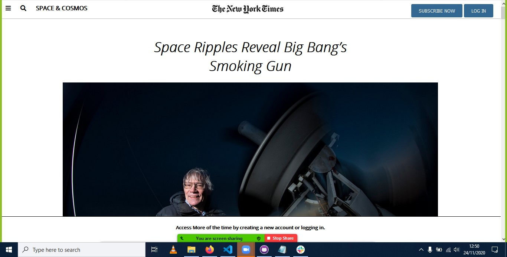

# Newyork Times Projrect 

This is a Clone of the Newtork Times Website to demonstrate the use of flex grid and float

## Screenshot of our cloned website

## Buit with

-HTML
-CSS3
-Font awesome icons
-Google fonts

## live Demo

Click! [Here](https://raw.githack.com/sempermort/NewyorkTimes/Developing/Index.html)   

## To get a local copy up and running follow these simple example steps.

## Setup

Clone the project locally.

## Linters

1. run npm install.
2. run npm run test to check the Html and Css files.

## Deployment

Install and run a live server plugin on you IDE/Text editor and run it from the root directory.

## Authors
- 👤 Jackson Morton [@sempermort](https://github.com/sempermort) 
- 👤 Ralph Oburu [@Ralph-1](https://github.com/Ralph-1) 

## Show your support

Give a ⭐️ if you like this project!

## 📝 License

This project is [MIT]licensed.

